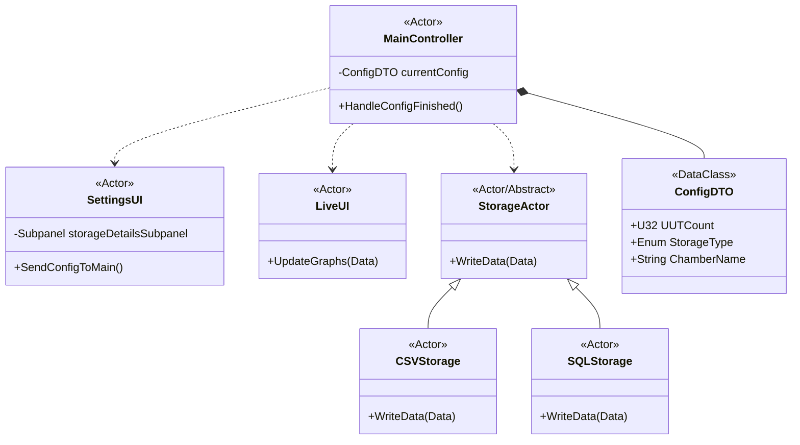

# Klassen

## Klassendiagramm 

```mermaid
classDiagram
    class MainController {
        <<Actor>>
        -ConfigDTO currentConfig
        +HandleConfigFinished()
    }

    class SettingsUI {
        <<Actor>>
        -Subpanel storageDetailsSubpanel
        +SendConfigToMain()
    }

    class LiveUI {
        <<Actor>>
        +UpdateGraphs(Data)
    }

    class StorageActor {
        <<Actor/Abstract>>
        +WriteData(Data)
    }

    class CSVStorage {
        <<Actor>>
        +WriteData(Data)
    }

    class SQLStorage {
        <<Actor>>
        +WriteData(Data)
    }

    class ConfigDTO {
        <<DataClass>>
        +U32 UUTCount
        +Enum StorageType
        +String ChamberName
    }

    %% Beziehungen
    MainController *-- ConfigDTO
    MainController ..> SettingsUI
    MainController ..> LiveUI
    MainController ..> StorageActor
    StorageActor <|-- CSVStorage
    StorageActor <|-- SQLStorage
```