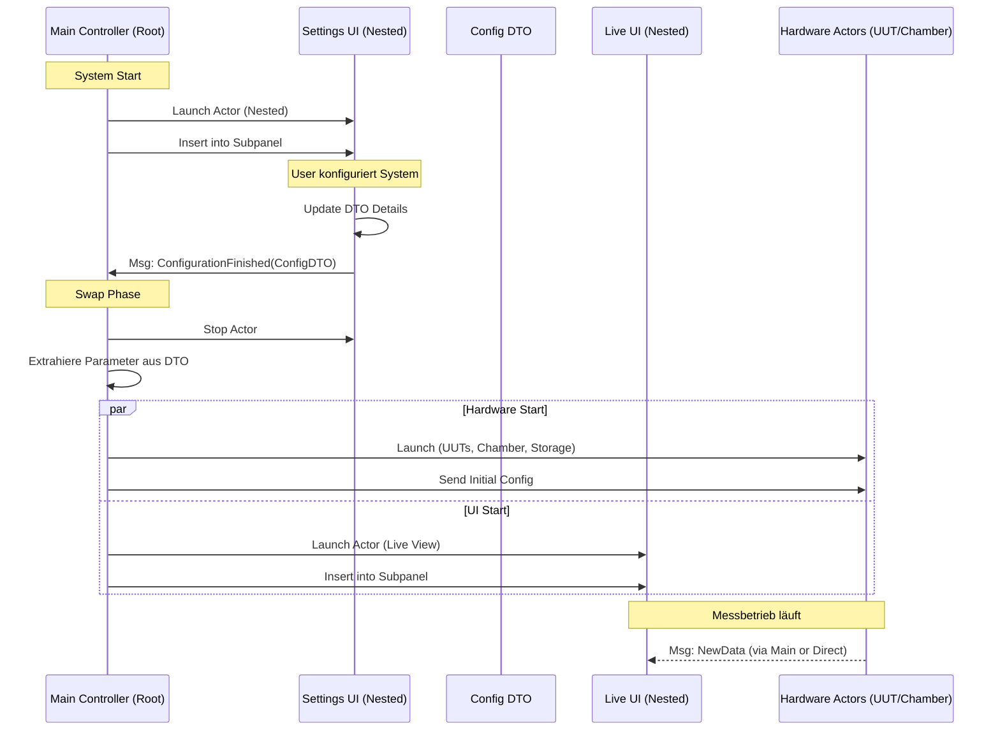

# Sequenzen

## Sequenzdiagramme

```mermaid
sequenceDiagram
    participant M as Main Controller (Root)
    participant S as Settings UI (Nested)
    participant DTO as Config DTO
    participant L as Live UI (Nested)
    participant HW as Hardware Actors (UUT/Chamber)

    Note over M: System Start
    M->>S: Launch Actor (Nested)
    M->>S: Insert into Subpanel
    
    Note over S: User konfiguriert System
    S->>S: Update DTO Details
    S->>M: Msg: ConfigurationFinished(ConfigDTO)
    
    Note over M: Swap Phase
    M->>S: Stop Actor
    M->>M: Extrahiere Parameter aus DTO
    
    par Hardware Start
        M->>HW: Launch (UUTs, Chamber, Storage)
        M->>HW: Send Initial Config
    and UI Start
        M->>L: Launch Actor (Live View)
        M->>L: Insert into Subpanel
    end

    Note over HW, L: Messbetrieb läuft
    HW-->>L: Msg: NewData (via Main or Direct)
```
